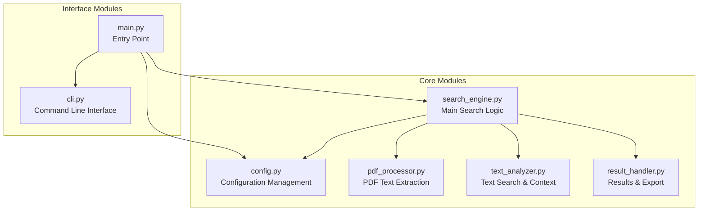

# ZotGrep Modularization Plan

## Executive Summary

This document outlines the plan that was used to refactor the former monolithic `zotgrep.py` script into a modular, maintainable architecture. The goal was to separate concerns into logical modules to make the codebase easier to maintain and extend with new features.

## Current State Analysis

The original `zotgrep.py` implementation was a monolithic script with 488 lines containing multiple responsibilities:

1. **Configuration Management** (lines 24-34)
2. **PDF Text Extraction** (lines 38-60)
3. **Text Search & Context Finding** (lines 63-126)
4. **URL Generation** (lines 128-138)
5. **Core Search Logic** (lines 140-377)
6. **Result Processing & Export** (lines 379-413)
7. **CLI Interface & Main Execution** (lines 433-488)

## Proposed Modular Architecture

### Architecture Overview



### Module Breakdown

#### 1. `config.py` - Configuration Management
**Purpose**: Centralize all configuration settings and validation

**Responsibilities**:
- Zotero API configuration (USER_ID, API_KEY, LIBRARY_TYPE)
- File path settings (BASE_ATTACHMENT_PATH)
- Search parameters (max_results_stage1, CONTEXT_SENTENCE_WINDOW)
- Configuration validation functions
- Environment variable support for sensitive data

**Key Functions**:
- `load_config()` - Load and validate configuration
- `validate_zotero_config()` - Validate Zotero settings
- `validate_paths()` - Validate file paths
- `get_config()` - Get configuration object

#### 2. `pdf_processor.py` - PDF Processing
**Purpose**: Handle all PDF-related operations

**Responsibilities**:
- PDF text extraction from bytes
- Handling linked vs imported PDF files
- Text cleaning and formatting
- PDF-specific error handling

**Key Functions**:
- `extract_text_from_pdf_bytes()` - Extract text from PDF (from line 38)
- `process_linked_pdf()` - Handle linked PDF files
- `process_imported_pdf()` - Handle imported PDF files
- `clean_pdf_text()` - Clean and format extracted text

#### 3. `text_analyzer.py` - Text Analysis & Search
**Purpose**: Text processing, search, and context extraction

**Responsibilities**:
- Text tokenization and sentence splitting
- Search term matching with context windows
- Text highlighting and formatting
- NLTK integration and setup

**Key Functions**:
- `find_context_sentences()` - Find context using sentences (from line 63)
- `find_context_sentences_detailed()` - Detailed sentence context (from line 82)
- `find_context()` - Character-based context finding (from line 105)
- `setup_nltk()` - Initialize NLTK dependencies
- `highlight_terms()` - Apply highlighting to found terms

#### 4. `search_engine.py` - Core Search Logic
**Purpose**: Orchestrate the search process

**Responsibilities**:
- Zotero API interactions
- Search workflow coordination
- Progress tracking and logging
- Integration of all search components

**Key Functions**:
- `ZoteroSearchEngine` class - Main search orchestrator
- `search_metadata()` - Search Zotero metadata
- `search_full_text()` - Search PDF full text
- `process_search_results()` - Process and combine results

#### 5. `result_handler.py` - Results Processing & Export
**Purpose**: Handle search results and output formatting

**Responsibilities**:
- Result data structure management
- CSV export functionality
- Console output formatting
- Zotero URL generation

**Key Functions**:
- `generate_zotero_url()` - Generate Zotero URLs (from line 128)
- `save_results_to_csv()` - CSV export (from line 379)
- `print_results()` - Console output (from line 415)
- `format_result()` - Format individual results

#### 6. `cli.py` - Command Line Interface
**Purpose**: Handle user interaction and argument parsing

**Responsibilities**:
- Command-line argument parsing
- Interactive user prompts
- Input validation
- Help and usage information

**Key Functions**:
- `parse_arguments()` - Parse CLI arguments
- `interactive_search()` - Handle interactive mode
- `validate_input()` - Validate user input
- `display_help()` - Show usage information

#### 7. `main.py` - Entry Point
**Purpose**: Application entry point and coordination

**Responsibilities**:
- Main execution flow
- Module coordination
- High-level error handling
- Backward compatibility

**Key Functions**:
- `main()` - Main entry point
- `run_search()` - Coordinate search execution
- `handle_errors()` - Global error handling

## Implementation Plan

### Phase 1: Setup and Configuration
1. Create package structure
2. Extract configuration to `config.py`
3. Set up package initialization
4. Create basic tests structure

### Phase 2: Core Module Extraction
1. Extract PDF processing to `pdf_processor.py`
2. Extract text analysis to `text_analyzer.py`
3. Extract result handling to `result_handler.py`
4. Update imports and dependencies

### Phase 3: Search Engine Refactoring
1. Refactor large search function into `search_engine.py`
2. Create clean interfaces between modules
3. Implement proper error handling
4. Add logging and progress tracking

### Phase 4: Interface and Entry Point
1. Extract CLI logic to `cli.py`
2. Create new `main.py` entry point
3. Ensure backward compatibility
4. Update documentation

### Phase 5: Testing and Validation
1. Create comprehensive test suite
2. Test each module independently
3. Integration testing
4. Performance validation

## File Structure After Modularization

```
project-root/
├── main.py                 # New entry point
├── zotgrep/             # Package directory
│   ├── __init__.py       # Package initialization
│   ├── config.py         # Configuration management
│   ├── cli.py            # Command line interface
│   ├── search_engine.py  # Core search logic
│   ├── pdf_processor.py  # PDF text extraction
│   ├── text_analyzer.py  # Text search & context
│   └── result_handler.py # Results & export
├── tests/                 # Test directory
│   ├── __init__.py
│   ├── test_config.py
│   ├── test_pdf_processor.py
│   ├── test_text_analyzer.py
│   ├── test_search_engine.py
│   ├── test_result_handler.py
│   └── test_cli.py
├── README.md
├── requirements.txt
└── MODULARIZATION_PLAN.md # This document
```

## Benefits of This Architecture

### Maintainability
- **Single Responsibility**: Each module has one clear purpose
- **Loose Coupling**: Modules interact through well-defined interfaces
- **High Cohesion**: Related functionality is grouped together

### Extensibility
- **Plugin Architecture**: New processors or analyzers can be added easily
- **Configuration Flexibility**: Easy to add new configuration options
- **Output Formats**: New export formats can be added to result_handler

### Testability
- **Unit Testing**: Each module can be tested independently
- **Mocking**: Dependencies can be easily mocked for testing
- **Integration Testing**: Clear interfaces make integration testing straightforward

### Debugging
- **Error Isolation**: Issues can be traced to specific modules
- **Logging**: Each module can have its own logging configuration
- **Profiling**: Performance bottlenecks can be identified per module

## Migration Strategy

### Backward Compatibility
- Preserve the existing CLI behavior while moving the implementation into the package
- New `main.py` provides the same top-level interface
- All existing command-line arguments work unchanged
- Same output formats and behavior

### Gradual Migration
- Users can continue using the packaged CLI during transition
- New features will be added to modular version
- Documentation will guide users to new entry point
- Transitional entry points can be simplified in future versions

## Dependencies and Requirements

### Current Dependencies
- `pyzotero` - Zotero API interaction
- `pypdfium2` - PDF text extraction
- `nltk` - Natural language processing
- Standard library modules (os, re, csv, argparse, sys, io, datetime)

### New Dependencies
- No additional external dependencies required
- Better organization of existing dependencies
- Clearer dependency injection between modules

## Testing Strategy

### Unit Tests
- Each module will have comprehensive unit tests
- Mock external dependencies (Zotero API, file system)
- Test edge cases and error conditions

### Integration Tests
- Test module interactions
- End-to-end search workflows
- Configuration validation

### Performance Tests
- Ensure modularization doesn't impact performance
- Memory usage validation
- Large PDF processing tests

## Documentation Updates

### Code Documentation
- Comprehensive docstrings for all modules and functions
- Type hints for better IDE support
- Usage examples in docstrings

### User Documentation
- Updated README with new structure
- Migration guide for existing users
- API documentation for developers

## Success Criteria

1. **Functionality**: All existing features work identically
2. **Performance**: No significant performance degradation
3. **Maintainability**: Code is easier to understand and modify
4. **Testability**: Comprehensive test coverage (>90%)
5. **Documentation**: Clear documentation for all modules
6. **Backward Compatibility**: Existing users can continue without changes

## Timeline

- **Week 1**: Phase 1 - Setup and Configuration
- **Week 2**: Phase 2 - Core Module Extraction  
- **Week 3**: Phase 3 - Search Engine Refactoring
- **Week 4**: Phase 4 - Interface and Entry Point
- **Week 5**: Phase 5 - Testing and Validation

## Next Steps

1. Review and approve this plan
2. Begin implementation with Phase 1
3. Set up development environment with proper testing
4. Create initial package structure
5. Start with configuration extraction

This modularization will transform ZotGrep from a monolithic script into a professional, maintainable Python package while preserving all existing functionality and user experience.
