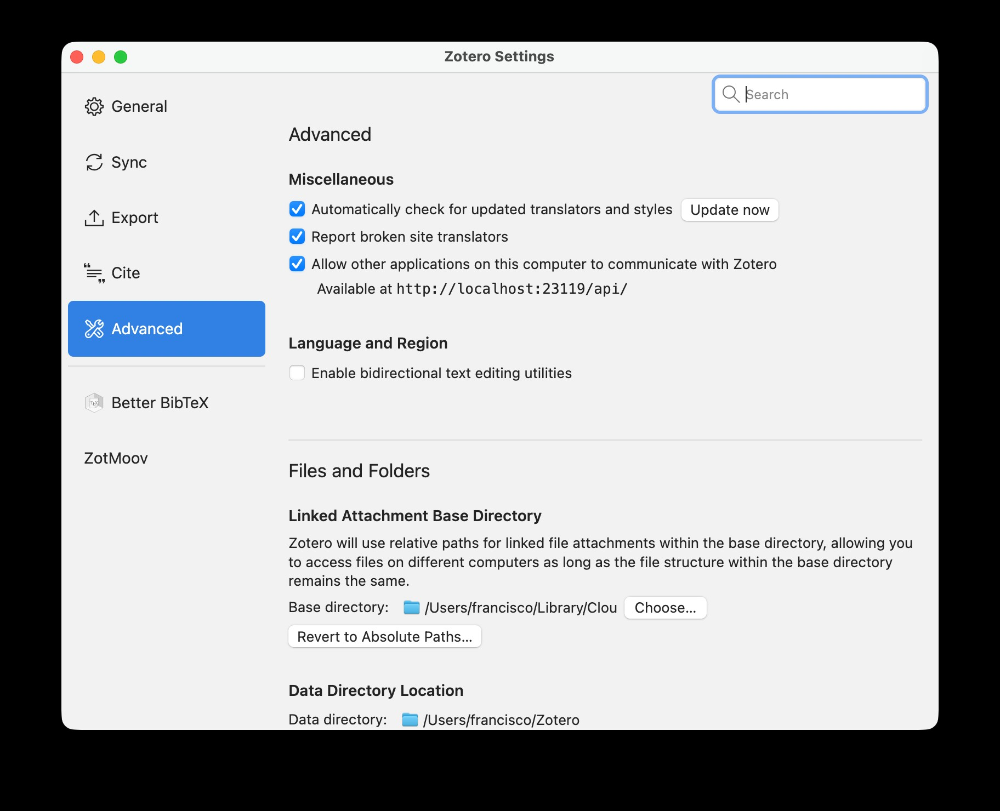
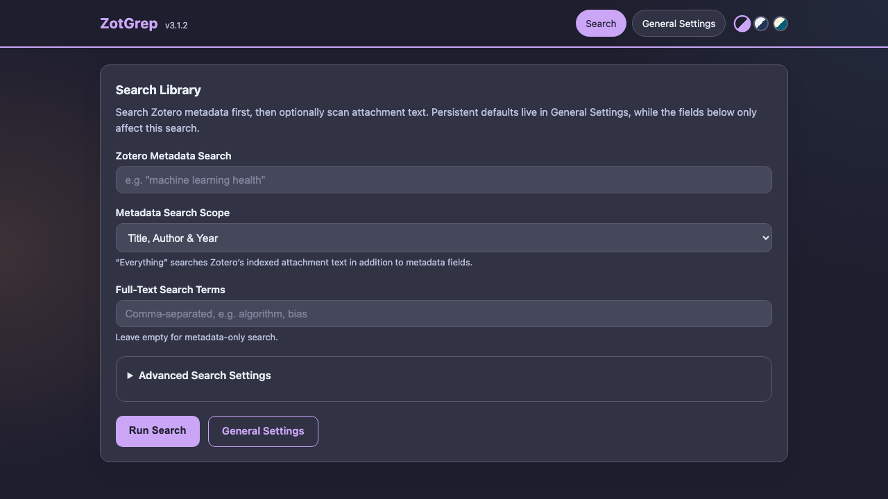
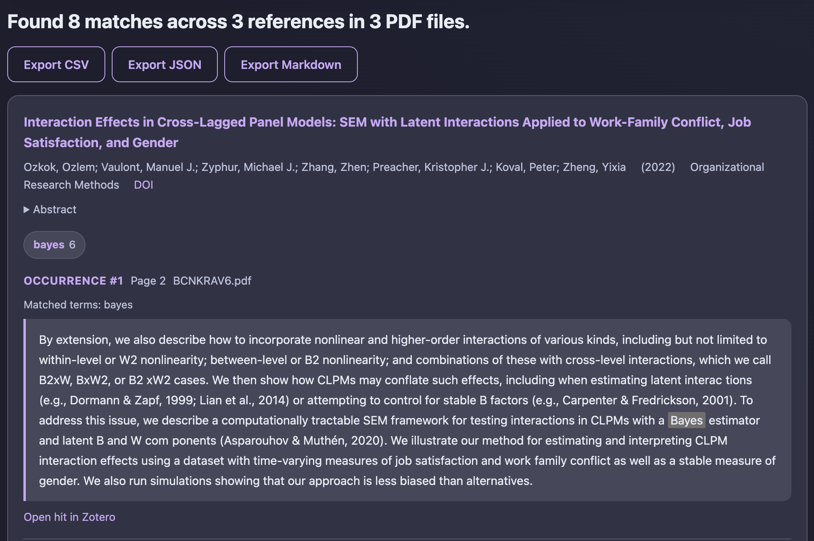
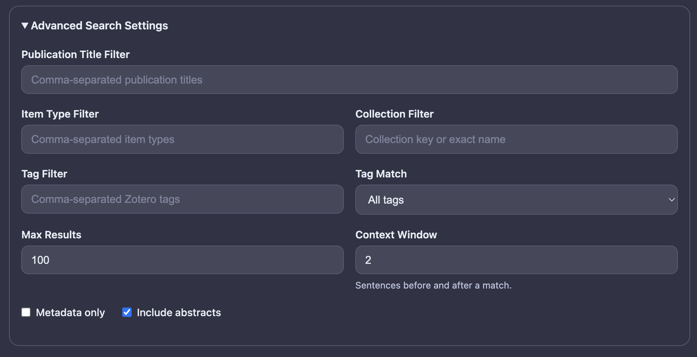
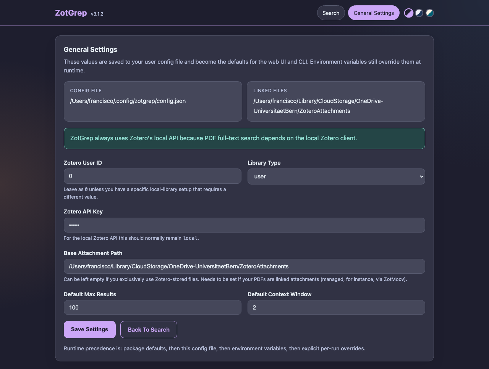

# What is ZotGrep?

A Python tool that lets you **search across your Zotero library** — both metadata and full-text PDFs — from a local web interface or the command line.

::: {.incremental}
- Search Zotero metadata (titles, authors, years)
- Full-text search inside PDF attachments
- Context-aware text snippets with highlighted terms
- Export results as CSV, Markdown, or JSON
- Direct links back to Zotero items and PDF pages
:::

---

## Two-Stage Search {.smaller}

**Stage 1** — Query Zotero's API for matching references (titles, authors, years)

**Stage 2** — Search within the PDFs of those references for specific terms

. . .

> You can use Stage 1 alone (metadata-only) or both stages together.

# Part 1: Installation {background-color="#0984e3"}

## Prerequisites

ZotGrep requires:

- **Python 3.10+**
- **Zotero 7 or higher** running locally (ZotGrep uses the local Zotero API)

---

### Install uv (recommended Python package manager)

::: {.panel-tabset}

### macOS / Linux
```bash
curl -LsSf https://astral.sh/uv/install.sh | sh
```

### Windows
```powershell
powershell -ExecutionPolicy ByPass -c "irm https://astral.sh/uv/install.ps1 | iex"
```

### Homebrew
```bash
brew install uv
```

:::

---

## Install ZotGrep

The recommended way is to install ZotGrep as a **uv tool** (isolated global command):

```bash
uv tool install zotgrep
```

. . .

Verify the installation:

```bash
zotgrep --version
```

. . .

::: {.callout-tip}
## Alternative: as a project dependency
```bash
uv add zotgrep
```
:::

---

## Enable Zotero's Local API {.smaller}

:::: {.columns}
::: {.column width="35%"}
Enable the **local API** in Zotero:

1. Open **Zotero → Settings → Advanced**
2. Check **"Allow other applications on this computer to communicate with Zotero"**

::: {.callout-important}
Zotero must be **open and running** whenever you use ZotGrep.
:::
:::

::: {.column width="65%"}
{fig-alt="Zotero Advanced Settings showing the local API checkbox enabled"}
:::
::::

---

## Linked Attachment Base Directory

If you use **linked file attachments** in Zotero (rather than stored copies), note your **Linked Attachment Base Directory** from the same settings page (under *Files and Folders*).

You'll need this path later for ZotGrep's `base_attachment_path` setting.

. . .

::: {.callout-tip}
If you only use Zotero-stored attachments (the default), you can skip this step.
:::


# Part 2: Web UI — Basic Usage {background-color="#00b894"}

## Launching the Web UI

Start the web interface with:

```bash
zotgrep --web
```

. . .

This opens a local Flask server at:

**`http://localhost:23120`**

. . .

Use a custom port if needed:

```bash
zotgrep --web --port 8080
```

---

## The Search Page

{fig-alt="ZotGrep main search page showing the search form with Zotero metadata search, scope selector, and full-text search fields" width="90%"}

The search page has two main input fields:

1. **Zotero Search** (required) — metadata search terms
2. **Full-Text Search Terms** (optional) — comma-separated terms to search inside PDFs

---

## Searching: A Walkthrough {.smaller}

Enter your **Zotero metadata search** terms and optionally add **full-text search terms** (comma-separated) to search inside matched PDFs.

. . .

Check **"Metadata only"** in Advanced Search Settings if you only want reference results without PDF processing.

> Tip: Use the **metadata search scope** dropdown to switch between *Title, Author & Year* (fast, precise) and *Everything* (broader, includes Zotero-indexed content).

---

## Search Results {.smaller}

Results are grouped by reference, with occurrence counts, context snippets, and direct links:

{fig-alt="ZotGrep search results page showing a matched paper with term occurrence count, highlighted context snippet, and links to open in Zotero" width="90%"}

- **Export buttons** (CSV, JSON, Markdown) appear at the top
- Each match shows the **page number** and a link to **open the hit in Zotero**

---

## Understanding Results {.smaller}

Each result card shows:

::: {.incremental}
- **Reference info** — title, authors, year, publication
- **Per-term occurrence counts** — colored pills (e.g., `algorithm: 12`)
- **Context snippets** — sentences around each match with highlighted terms
- **Zotero link** — click to open the item directly in Zotero
- **Page links** — jump to the specific PDF page of each hit
- **DOI link** — when available
:::

. . .

> First 10 hits per reference are shown; click to expand the rest.

---

## Full-Text Query Syntax {.smaller}

The full-text search field supports more than simple terms:

| Syntax | Example | Meaning |
|--------|---------|---------|
| Simple terms | `algorithm, bias` | Search for each term |
| Quoted phrases | `"machine learning"` | Exact phrase match |
| Wildcards | `algorithm*` | Prefix matching |
| AND | `privacy AND fairness` | Both must appear |
| OR | `privacy OR security` | Either can appear |
| Grouping | `(privacy OR security) AND model` | Combined logic |

---

## Metadata Search Scope

Two modes available via the dropdown:

. . .

**titleCreatorYear** (default)

- Searches title, author, and year fields
- Fast and precise

. . .

**everything**

- Also searches Zotero's indexed attachment content
- Broader results, slower

---

## Exporting Results

After a search, use the **export buttons** at the top of the results:

{width="70%"}

| Format | Best for |
|--------|----------|
| **CSV** | Spreadsheet analysis (Excel, R, pandas) |
| **JSON** | Programmatic use, data pipelines |
| **Markdown** | Research notes, documentation |

. . .

> The export includes all results from your last search, not just what's currently visible on screen.

---

## Themes

ZotGrep ships with three visual themes, selectable from the top-right corner:

- **(Catpuccin) Mocha** — dark theme (default)
- **(Catpuccin) Latte** — light theme
- **Solarized** — light theme with warm tones

Your choice is saved in the browser and persists across sessions.

# Part 3: Advanced Settings {background-color="#6c5ce7"}

## Search Page: Advanced Settings

Click **"Advanced Search Settings"** on the search page to expand filter options:

{fig-alt="ZotGrep advanced search settings panel showing filter fields for publication title, item type, collection, tags, max results, context window, and checkboxes for metadata-only and include abstracts" width="80%"}

---

## Filter Options {.smaller}

| Filter | What it does |
|--------|-------------|
| **Publication title** | Only show results from specific journals/venues |
| **Item type** | Filter by Zotero type (`journalArticle`, `book`, etc.) |
| **Collection** | Restrict to a Zotero collection (by key or exact name) |
| **Tags** | Filter by Zotero tags |
| **Tag match mode** | Require **all** tags or **any** tag |
| **Max results** | Limit number of Stage 1 results (default: 100) |
| **Context window** | Sentences before/after each match (default: 2) |
| **Metadata only** | Skip PDF processing entirely |
| **Include abstracts** | Show abstracts in result cards |

---

## General Settings Page {.smaller}

Navigate to **General Settings** (link in the top-right) to configure persistent defaults:

{fig-alt="ZotGrep general settings page showing configuration fields for Zotero connection, file paths, and default search parameters" width="90%"}

These settings are saved to `~/.config/zotgrep/config.json`.

---

## Configuration File {.smaller}

You can also edit the config file directly:

```json
{
  "zotero_user_id": "0",
  "zotero_api_key": "local",
  "library_type": "user",
  "base_attachment_path": "/path/to/your/linked/pdfs",
  "max_results_stage1": 100,
  "context_sentence_window": 2
}
```

. . .

::: {.callout-tip}
## Linked files?
If you use **linked** PDF attachments in Zotero (not stored in Zotero's data directory), set `base_attachment_path` to the root directory containing your PDFs.
:::

---

## Configuration Priority {.smaller}

Settings are resolved in this order (highest priority wins):

1. **Environment variables** (e.g., `ZOTERO_BASE_ATTACHMENT_PATH`)
2. **CLI arguments** (e.g., `--max-results 50`)
3. **Config file** (`~/.config/zotgrep/config.json`)
4. **Package defaults**

. . .

Example environment variable override:

```bash
export ZOTERO_BASE_ATTACHMENT_PATH="/Users/me/Papers"
zotgrep --web
```

---

## Environment Variables {.smaller}

| Variable | Config equivalent |
|----------|-----------------|
| `ZOTERO_USER_ID` | `zotero_user_id` |
| `ZOTERO_API_KEY` | `zotero_api_key` |
| `ZOTERO_LIBRARY_TYPE` | `library_type` |
| `ZOTERO_BASE_ATTACHMENT_PATH` | `base_attachment_path` |
| `ZOTERO_MAX_RESULTS` | `max_results_stage1` |
| `ZOTERO_CONTEXT_WINDOW` | `context_sentence_window` |
| `ZOTERO_PUBLICATION_TITLE_FILTER` | `publication_title_filter` |
| `ZOTERO_ITEM_TYPE_FILTER` | `item_type_filter` |
| `ZOTERO_COLLECTION_FILTER` | `collection_filter` |
| `ZOTERO_TAG_FILTER` | `tag_filter` |
| `ZOTERO_TAG_MATCH_MODE` | `tag_match_mode` |
| `ZOTERO_METADATA_SEARCH_MODE` | `metadata_search_mode` |

# Part 4: CLI Usage {background-color="#e17055"}

## Interactive Mode

Run without arguments for an interactive prompt:

```bash
zotgrep
```

. . .

You'll be prompted for:

1. Zotero search terms
2. Whether to do full-text search
3. Full-text search terms (if yes)
4. Output format preferences

---

## Non-Interactive Mode {.smaller}

Pass arguments directly for scripted/automated use:

```bash
# Metadata search only
zotgrep --zotero "machine learning health" --metadata-only

# With full-text search
zotgrep --zotero "AI ethics" --fulltext "privacy, fairness"

# Filter by collection
zotgrep --zotero "career" --collection "Literature Review"

# Filter by tags
zotgrep --zotero "NLP" --tag "important, review" --tag-match any
```

---

## Output Options {.smaller}

```bash
# Save to CSV
zotgrep --zotero "search terms" --csv results.csv

# Save to Markdown
zotgrep --zotero "search terms" --md results.md

# Save to JSON (explicit path)
zotgrep --zotero "search terms" --json results.json

# CSV only, no console output
zotgrep --zotero "search terms" --csv results.csv --csv-only

# Disable default JSON export
zotgrep --zotero "search terms" --no-json

# Multiple formats at once
zotgrep --zotero "search terms" --csv out.csv --md out.md --json out.json
```

---

## CLI Search Options {.smaller}

```bash
# Change metadata search scope
zotgrep --zotero "broad query" --search-mode everything

# Filter by publication title
zotgrep --zotero "term" --publication "Nature, Science"

# Filter by item type
zotgrep --zotero "term" --item-type "journalArticle, book"

# Adjust context window (sentences around each match)
zotgrep --zotero "term" --fulltext "word" --context-window 4

# Limit results
zotgrep --zotero "term" --max-results 50

# Use custom config file
zotgrep --zotero "term" --config /path/to/config.json
```

---

## CLI + Web Comparison {.smaller}

| Feature | Web UI | CLI |
|---------|--------|-----|
| Interactive search | Yes | Yes (interactive mode) |
| Scriptable | No | Yes |
| Export CSV/JSON/MD | Yes (buttons) | Yes (flags) |
| Advanced filters | Yes (UI panel) | Yes (arguments) |
| Persistent settings | Yes (settings page) | Yes (config file) |
| Zotero links | Clickable | In output files |
| Full-text source toggle | No (uses default) | Yes (`--fulltext-source`) |

---

# Quick Start Cheat Sheet {background-color="#2d3436"}

```bash
# 1. Install
uv tool install zotgrep

# 2. Make sure Zotero 7 is running

# 3. Launch web UI
zotgrep --web

# 4. Open browser to http://localhost:23120

# 5. Or use CLI directly
zotgrep --zotero "your search" --fulltext "term1, term2"
```

---

## Resources

- **GitHub**: [github.com/franciscowilhelm/zotgrep](https://github.com/franciscowilhelm/zotgrep)
- **PyPI**: [pypi.org/project/zotgrep](https://pypi.org/project/zotgrep)
- **Issues**: [github.com/franciscowilhelm/zotgrep/issues](https://github.com/franciscowilhelm/zotgrep/issues)

. . .

::: {.callout-tip}
## Feedback welcome!
Open an issue on GitHub if you have questions or feature requests.
:::

# Thank you! {background-color="#2d3436"}

```bash
uv tool install zotgrep && zotgrep --web
```
